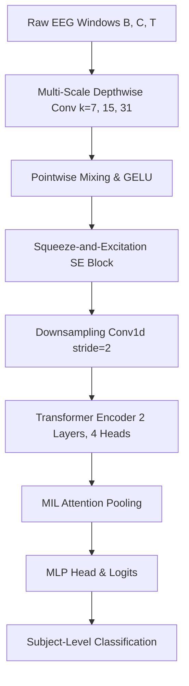
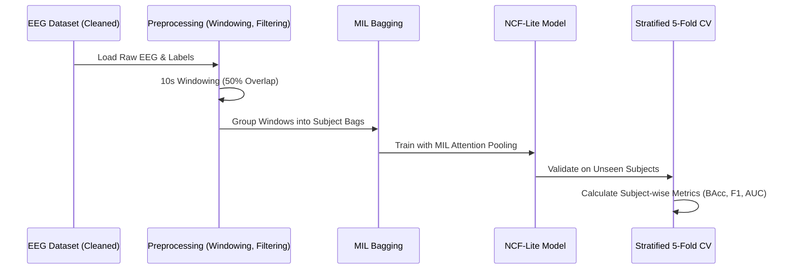

# NeuroConvFormer-Lite (NCF-Lite) for Parkinson's Disease Detection

## Project Overview
This research project focuses on the automated detection of **Parkinson's Disease (PD)** using **Resting-State EEG** signals. It introduces **NeuroConvFormer-Lite (NCF-Lite)**, a hybrid deep learning architecture that combines Multi-Scale Depthwise Convolutions with Transformer Encoders, optimized for high performance and efficiency (under 250k parameters).

The project employs a **Multiple Instance Learning (MIL)** framework, treating each subject's EEG recording as a "bag" of 10-second windows. This approach allows the model to learn subject-level representations by aggregating features from multiple segments of the recording.

## Key Features
- **Hybrid Architecture:** Combines the local feature extraction of CNNs with the global dependency modeling of Transformers.
- **Multiple Instance Learning (MIL):** Specifically designed for subject-level classification from variable-length recordings.
- **Efficiency:** Lightweight model (<= 250k parameters) suitable for research and potential deployment.
- **Robust Evaluation:** Subject-wise Stratified 5-Fold Cross-Validation ensuring no data leakage between training and validation sets.
- **Support for Multiple Formats:** Processes `.set`, `.edf`, `.bdf`, `.fif`, and `.vhdr` EEG files via the MNE-Python library.
- **Advanced Training:** Utilizes Focal Loss for class imbalance, attention-based pooling, and confidence-trimmed inference.

---

## Model Architecture

The NCF-Lite architecture follows a sophisticated pipeline to transform raw EEG signals into diagnostic predictions:



---

## System Workflow

The following diagram illustrates the data processing and training pipeline:



---

## Performance Results (Cross-Validation)

The model was evaluated using a **Subject-wise Stratified 5-Fold Cross-Validation** protocol. Below are the average metrics across all folds:

| Metric | Window-Level (Mean ± Std) | Subject-Level (Mean ± Std) |
| :--- | :--- | :--- |
| **Accuracy** | 0.6725 ± 0.0495 | **0.6841 ± 0.0824** |
| **Balanced Accuracy** | 0.6521 ± 0.0741 | **0.6633 ± 0.1086** |
| **Precision** | 0.7826 ± 0.0813 | 0.8053 ± 0.0889 |
| **Recall** | 0.7249 ± 0.1383 | 0.7200 ± 0.1208 |
| **F1-Score** | 0.7371 ± 0.0573 | 0.7502 ± 0.0755 |
| **AUC** | 0.7431 ± 0.0480 | 0.7543 ± 0.0615 |

---

## Project Structure
- `NCF.py`: Core script for training, validation, and MIL-based evaluation.
- `models/neuroconvformer.py`: Implementation of the NeuroConvFormer-Lite architecture.
- `requirements.txt`: Project dependencies.
- `prof_metrics(NCF).txt`: Detailed fold-wise performance logs.
- `Parkinsons_Model.ipynb`: Experimental notebook for model development and visualization.
- `test-2/`: Directory containing experimental variations and utility scripts.

---

## Installation & Usage

### 1. Requirements
Ensure you have Python 3.9+ and install the dependencies:
```bash
pip install -r requirements.txt
```

### 2. Configuration
Update the following paths in `NCF.py` to point to your local dataset:
```python
ROOT_DIR  = "path/to/your/cleaned/eeg/dataset"
label_dir = "path/to/your/labels"
```

### 3. Training
Run the main script to start the training and cross-validation process:
```bash
python NCF.py
```

---

## Research Context
This project is part of ongoing research into efficient deep-learning models for neurological disorder detection. The use of NCF-Lite demonstrates that high performance can be achieved with significantly reduced parameter counts, making these models more accessible for clinical and edge-computing applications.
